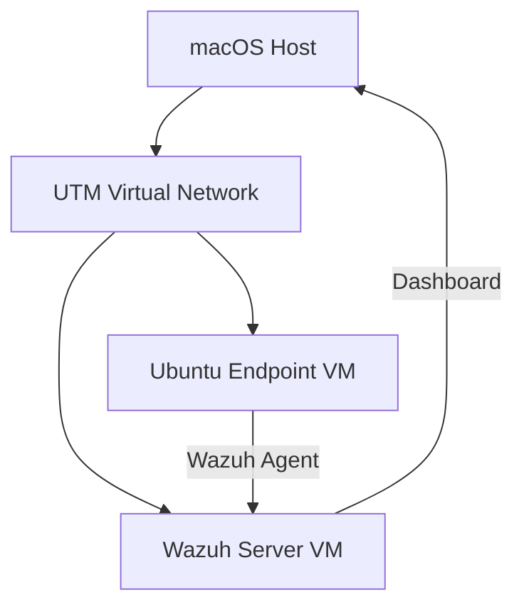
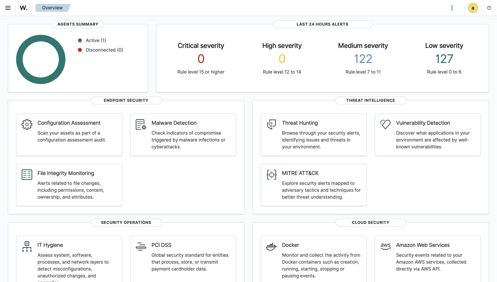
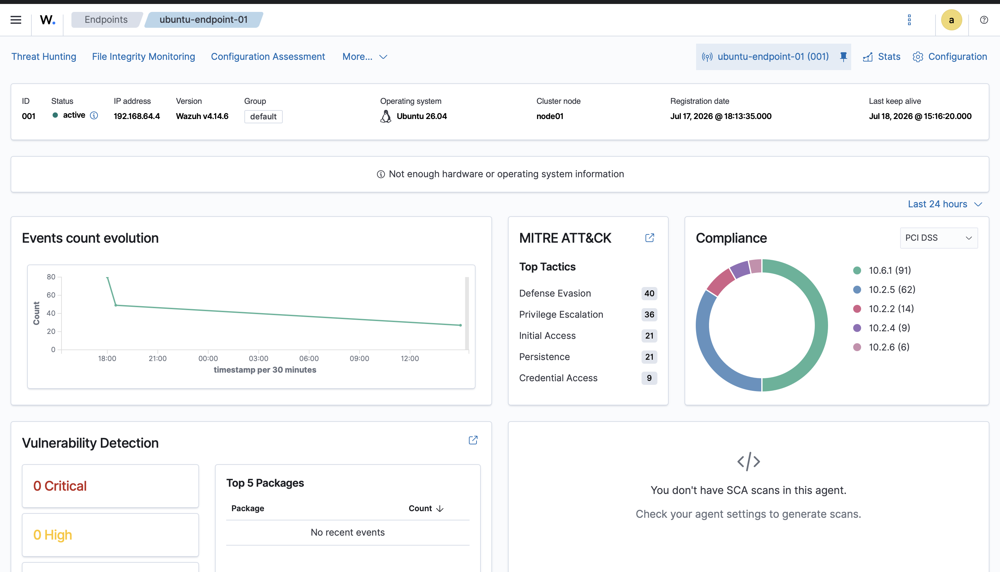
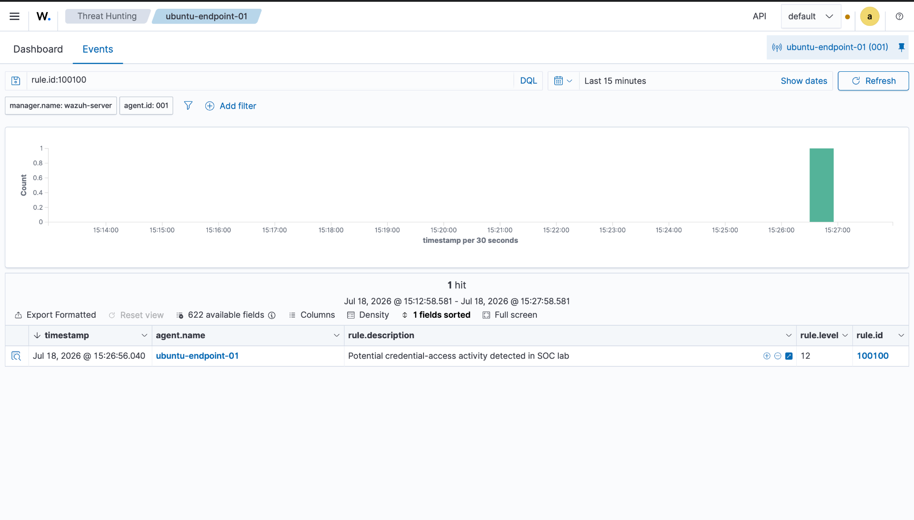
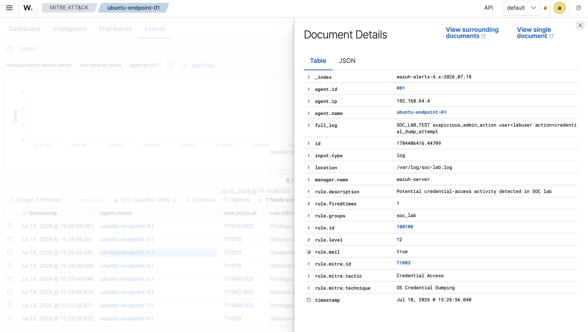

# Wazuh SOC Home Lab

## Overview

This project documents a Wazuh SIEM home lab built with UTM on an Apple Silicon MacBook Pro. The lab uses a Wazuh all-in-one server and a separate Ubuntu endpoint to demonstrate endpoint enrollment, security event collection, file integrity monitoring, custom rule creation, and MITRE ATT&CK mapping.

The goal of this lab was to practice SOC analyst fundamentals in a local environment: deploying a SIEM, monitoring an endpoint, generating controlled alerts, investigating detections, and documenting findings.

## Lab Architecture



## Environment

| Component | Details |
| --- | --- |
| Host system | Apple Silicon MacBook Pro |
| Virtualization | UTM |
| Wazuh server | All-in-one Wazuh deployment |
| Wazuh version | 4.14.6 |
| Server hostname | `wazuh-server` |
| Endpoint hostname | `ubuntu-endpoint-01` |
| Endpoint OS | Ubuntu 26.04 |
| Endpoint agent ID | `001` |
| Endpoint IP | `192.168.64.4` |

## What This Lab Demonstrates

- Deployed a Wazuh SIEM server in a Linux VM.
- Enrolled an Ubuntu endpoint using the Wazuh agent.
- Verified active endpoint monitoring in the Wazuh dashboard.
- Generated and investigated failed SSH login alerts.
- Configured File Integrity Monitoring for a custom critical directory.
- Created a custom Wazuh rule for suspicious administrator activity.
- Mapped a custom detection to MITRE ATT&CK technique `T1003`.

## Repository Structure

```text
wazuh-soc-home-lab/
  README.md
  screenshots/
    01-wazuh-dashboard-working.png
    02-agent-active.png
    03-ssh-failed-login-detection.png
    04-file-integrity-monitoring.png
    05-custom-rule-detection.png
    06-mitre-t1003-mapping.png
  rules/
    soc_lab_rules.xml
  configs/
    fim-ossec-snippet.xml
    custom-log-ossec-snippet.xml
  docs/
    ssh-failed-login-investigation.md
    file-integrity-monitoring-report.md
    custom-rule-detection-report.md
```

## Screenshots

### Wazuh Dashboard Working



### Active Endpoint Agent



### Failed SSH Login Detection


### File Integrity Monitoring Detection


### Custom Rule Detection



### MITRE ATT&CK Mapping



## Detection Summary

| Detection | Query | Rule ID | Rule Level | Evidence |
| --- | --- | --- | --- | --- |
| Failed SSH login | `rule.groups:sshd` | `5710` | `5` | [SSH investigation](docs/ssh-failed-login-investigation.md) |
| File deleted in monitored directory | `rule.groups:syscheck` | `553` | `7` | [FIM report](docs/file-integrity-monitoring-report.md) |
| Custom suspicious admin action | `rule.id:100100` | `100100` | `12` | [Custom rule report](docs/custom-rule-detection-report.md) |

## File Integrity Monitoring Configuration

The endpoint was configured to monitor a custom critical directory:

```xml
<directories check_all="yes" realtime="yes" report_changes="yes">/opt/soc-lab/critical</directories>
```

Test activity:

```bash
sudo mkdir -p /opt/soc-lab/critical
echo 'production=true' | sudo tee /opt/soc-lab/critical/app.conf
echo 'debug=true' | sudo tee -a /opt/soc-lab/critical/app.conf
sudo rm /opt/soc-lab/critical/app.conf
```

## Custom Rule

The custom rule detected a simulated suspicious administrator action from `/var/log/soc-lab.log`.

```xml
<group name="soc_lab,">
  <rule id="100100" level="12">
    <match>SOC_LAB_TEST suspicious_admin_action</match>
    <description>Potential credential-access activity detected in SOC lab</description>
    <mitre>
      <id>T1003</id>
    </mitre>
  </rule>
</group>
```

Test event:

```bash
echo "SOC_LAB_TEST suspicious_admin_action user=labuser action=credential_dump_attempt" | sudo tee -a /var/log/soc-lab.log
```

## MITRE ATT&CK Mapping

The custom detection was mapped to:

| Field | Value |
| --- | --- |
| Tactic | Credential Access |
| Technique | OS Credential Dumping |
| Technique ID | `T1003` |

This mapping shows how custom alerts can be connected to known adversary behavior and used for better alert triage.

## Lessons Learned

- Wazuh agents forward endpoint activity to the Wazuh manager for analysis.
- SSH authentication events can be used to identify possible unauthorized access attempts.
- File Integrity Monitoring helps detect changes to sensitive files and directories.
- Custom Wazuh rules make it possible to detect organization-specific suspicious behavior.
- MITRE ATT&CK mappings add useful context for analysts investigating alerts.

## Future Improvements

- Add Windows endpoint monitoring with Sysmon.
- Add active response to block repeated SSH brute-force attempts.
- Build a small incident response playbook for each alert type.
- Add vulnerability detection screenshots after package scanning produces results.
- Expand custom rules for persistence, privilege escalation, and suspicious process execution.

## Security Notes

Credentials, generated certificates, Wazuh installation bundles, VM images, and full configuration files are intentionally excluded from this repository. Only sanitized snippets and screenshots are included.
