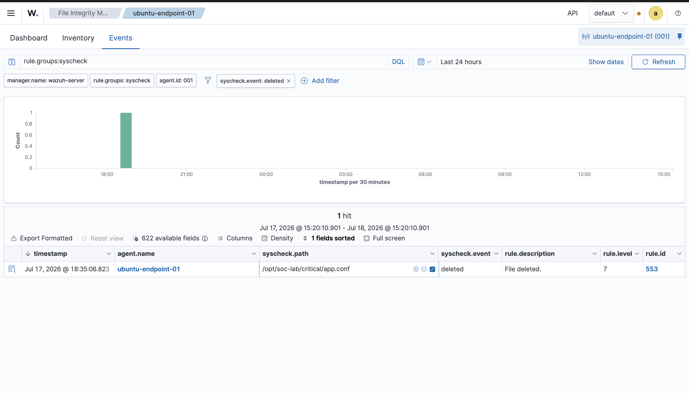

# File Integrity Monitoring Report

## Objective

Validate that Wazuh File Integrity Monitoring can detect file creation, modification, and deletion events in a monitored directory on the Ubuntu endpoint.

## Environment

- Wazuh server: `wazuh-server`
- Wazuh version: `4.14.6`
- Endpoint: `ubuntu-endpoint-01`
- Agent ID: `001`
- Endpoint IP: `192.168.64.4`
- Endpoint OS: `Ubuntu 26.04`
- Monitored directory: `/opt/soc-lab/critical`

## Configuration Added

The following File Integrity Monitoring directory was added inside the endpoint agent's `<syscheck>` section:

```xml
<directories check_all="yes" realtime="yes" report_changes="yes">/opt/soc-lab/critical</directories>
```

After updating the configuration, the Wazuh agent was restarted.

```bash
sudo systemctl restart wazuh-agent
```

## Test Performed

I created, modified, and deleted a test configuration file inside the monitored directory.

```bash
sudo mkdir -p /opt/soc-lab/critical
echo 'production=true' | sudo tee /opt/soc-lab/critical/app.conf
echo 'debug=true' | sudo tee -a /opt/soc-lab/critical/app.conf
sudo rm /opt/soc-lab/critical/app.conf
```

## Wazuh Detection

- Dashboard section: File Integrity Monitoring
- Query used: `rule.groups:syscheck`
- Agent: `ubuntu-endpoint-01`
- File path: `/opt/soc-lab/critical/app.conf`
- Example rule IDs observed:
  - `554`: File added to the system
  - `553`: File deleted
- Example rule level observed: `7`

## Analysis

Wazuh successfully detected activity inside the monitored directory. File Integrity Monitoring is important because unauthorized changes to sensitive files can indicate persistence, tampering, malware activity, or an attacker modifying system configuration.

In this lab, the monitored path represented a critical application directory. The test confirmed that Wazuh can alert when files in that directory are added or deleted.

## Analyst Response

An analyst reviewing this alert should:

- Confirm whether the file change was expected.
- Review the user account associated with the change.
- Check the file path and determine whether it is sensitive.
- Compare the event against approved maintenance or deployment activity.
- Investigate related alerts from the same endpoint around the same time.

## Screenshot

