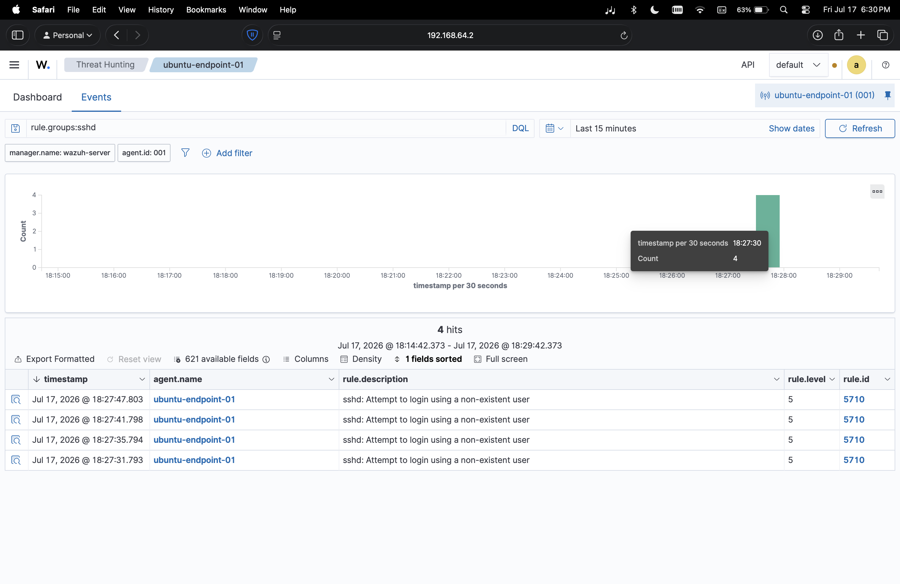

# SSH Failed Login Investigation

## Objective

Validate that Wazuh can detect failed SSH authentication attempts against a monitored Ubuntu endpoint.

## Environment

- Wazuh server: `wazuh-server`
- Wazuh version: `4.14.6`
- Endpoint: `ubuntu-endpoint-01`
- Agent ID: `001`
- Endpoint IP: `192.168.64.4`
- Endpoint OS: `Ubuntu 26.04`
- Log source: SSH authentication logs

## Test Performed

From the Mac host, I attempted to SSH into the endpoint using a non-existent username and intentionally failed the login.

```bash
ssh fakeuser@192.168.64.4
```

This generated failed authentication events on the Ubuntu endpoint, which were collected by the Wazuh agent and forwarded to the Wazuh manager.

## Wazuh Detection

- Dashboard section: Threat Hunting
- Query used: `rule.groups:sshd`
- Agent: `ubuntu-endpoint-01`
- Rule ID: `5710`
- Rule level: `5`
- Rule description: `sshd: Attempt to login using a non-existent user`
- Observed result: Multiple failed SSH login events appeared in Wazuh

## Analysis

Wazuh successfully detected SSH login attempts using a username that does not exist on the endpoint. This type of activity can indicate account discovery, password guessing, brute-force activity, or an unauthorized user attempting to access the system.

The alert is useful for SOC monitoring because SSH is a common remote administration service and is frequently targeted during initial access attempts.

## Analyst Response

An analyst reviewing this alert should:

- Confirm whether the login attempt was expected or authorized.
- Review the source IP address associated with the failed login.
- Check whether the same source generated repeated failures.
- Look for successful logins after the failed attempts.
- Consider blocking the source IP if the activity is suspicious and unauthorized.

## Screenshot

